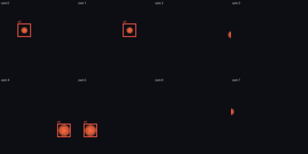
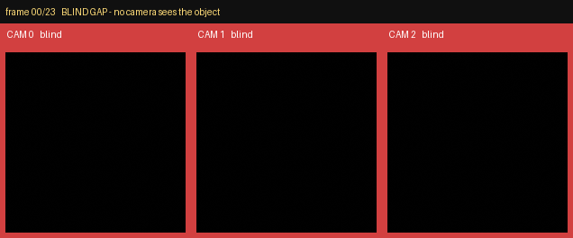

# multicam-sim



*multi-view: same object, 8 angles, one identity — eight ring cameras rendered by
the pure-numpy rasterizer, with the object's analytic projected box drawn in every
view that sees it. Reproduce: `uv run --with pillow python scripts/render_multiview_hero.py`.*



*One object, three cameras with **disjoint** views, one timeline — a green border
means that camera sees it, red means blind. The gaps between stations are the
non-overlapping-coverage problem multicam-sim exists to benchmark. (Moving frames
are the Linux/Modal [Kubric photoreal path](docs/kubric-modal.md); the analytic
geometry, not the pixels, is the contract.)*

**Can you recover a 3D point, or a human joint, when it is hidden in some camera
views but still seen in others?** multicam-sim builds the synthetic multi-camera
scenes you need to ask that question with ground truth in hand.

It sets up N calibrated pinhole cameras around a scene, moves objects (or a
skeleton) through it, decides for each camera which points are actually visible
versus occluded, and writes a single JSON **manifest**: the camera calibration,
the ground-truth 3D positions, every camera's 2D projection, and a per-point,
per-view visibility label. No renderer and no GL, just analytic projection and
boolean occlusion, so the geometry is exact.

## What it produces

The manifest is the contract. For each frame and each named point it records:

- `xyz_gt` — the ground-truth 3D world position;
- `per_cam[i].uv` — that point's pixel in camera `i`;
- `per_cam[i].visible` — whether camera `i` really sees it (in front of the
  camera, inside the image, and not blocked by an occluder);
- `per_cam[i].occ_frac` — a continuous "how marginal is this occlusion" score.

Optional per-camera labels, opt-in so the default manifest stays byte-identical:

- `per_cam[i].visible_fraction` / `per_cam[i].occluded` — analytic image-space
  silhouette occlusion (the fraction of the object's disc a nearer occluder eats,
  and whether any does), emitted when you pass `object_radius=` to
  `build_manifest`;
- `per_cam[i].dropped` — a seeded per-camera sensor dropout (a blanked frame is a
  coverage gap, never a zero occlusion), via `dropout=`;
- seeded pixel noise + a slightly-wrong `assumed` calibration under calibration
  drift, via `noise=` — ground truth stays exact.

Moving occluders (a swept `HandOccluder`) are resolved to their per-frame solid
before any visibility test, so these labels track the occluder's true pose.

A downstream triangulator (the companion package
[multicam-occlusion](https://github.com/bamdadd/multicam-occlusion)) reads the
manifest, masks on `visible`, and recovers each 3D point from the cameras that
still see it. Because the calibration is written at full precision, it rebuilds
the projection matrices and recovers ground truth to about machine epsilon. That
round-trip is the point: occluded-in-one-view recovery, checked against truth.
See [DESIGN.md](DESIGN.md) for the camera convention and the manifest schema.

## Quickstart

```bash
uv sync
uv run pytest -q      # the smoke test triangulates a cam-occluded frame to ~1e-6
```

Build a scene and write its manifest:

```python
from multicam_sim import build_smoke_scene, write_manifest

scene = build_smoke_scene()          # 3 ring cameras, a moving point, one occluder
manifest = write_manifest(scene, "scene.json")
```

A human pose is the same scene with a richer entity. It reuses the named-points
schema with no fork: a person is one entity with 17 COCO joints and a skeleton,
and every joint gets the same 3D / 2D / per-view occlusion labels as any point.

```python
from multicam_sim import PoseFrame, PoseTrajectory, Skeleton

joints = {j: [0.0, 0.0, 0.0] for j in Skeleton.coco17().joints}
person = PoseTrajectory(id="p0", skeleton=Skeleton.coco17(), frames=[PoseFrame(frame=0, joints=joints)])
entity = person.to_entity()          # drops into a Scene like any object
```

## Scope

- **Geometry, not rendering.** OpenCV pinhole projection and ray-vs-solid
  occlusion (boxes and spheres). No textures, lighting, or GL.
- **Objects today, poses typed.** Object points work end to end. The COCO-17
  pose types and manifest labels are in place; SMPL / SMPL-X dense bodies are an
  open extension point (the `MeshBackend` ABC), not yet implemented.
- **Producer only.** multicam-sim emits manifests; triangulation and evaluation
  live in multicam-occlusion. The camera convention here is mirrored from that
  package so a manifest is consumed convention-for-convention.

## License

Apache-2.0.
